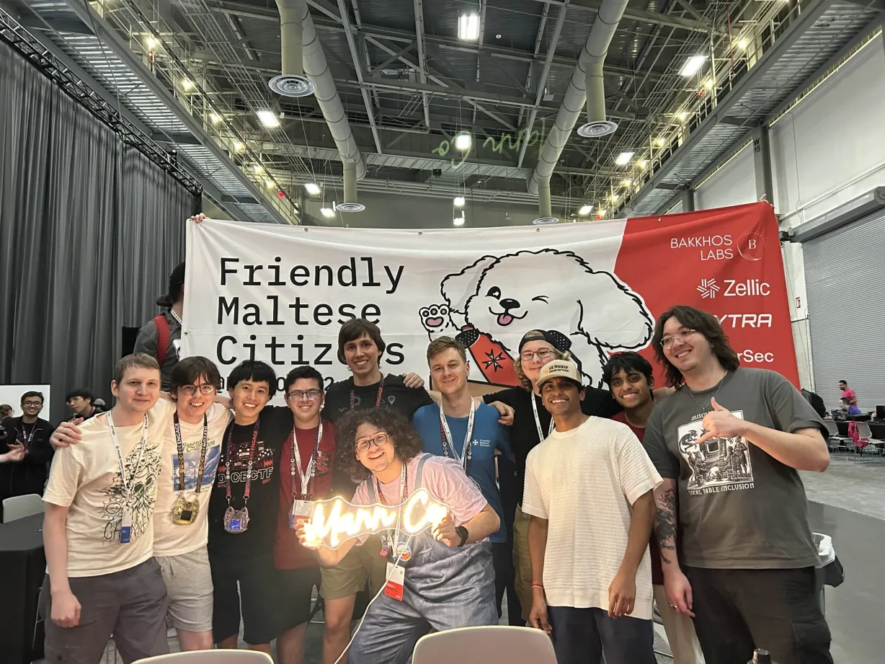

# Hot dog or not

## Solution
Adversarial attack on model misclassification to the desired class, with minimal change and maximal model confidence, combined with optimal l2 distance leading to the flag class boundary.

## flag image the model was trained on

